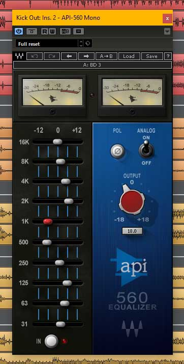
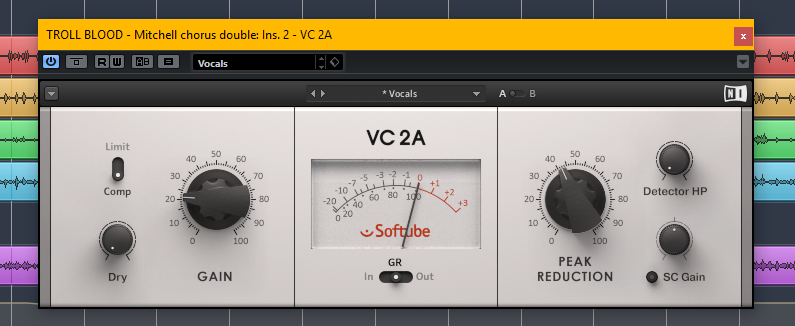
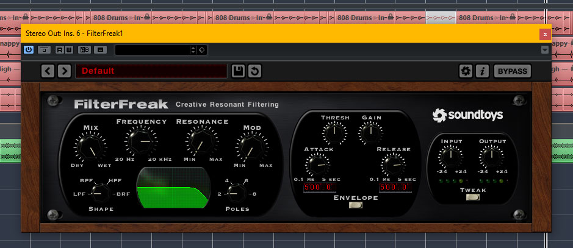
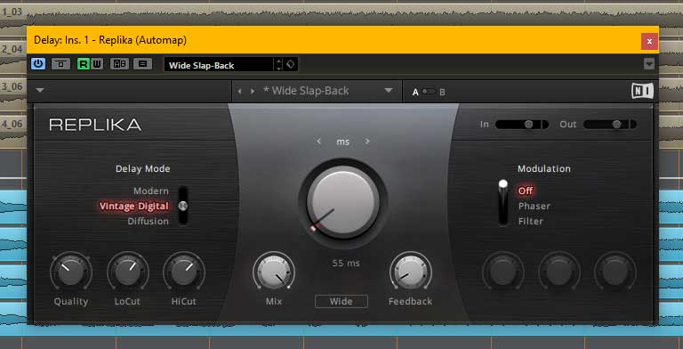
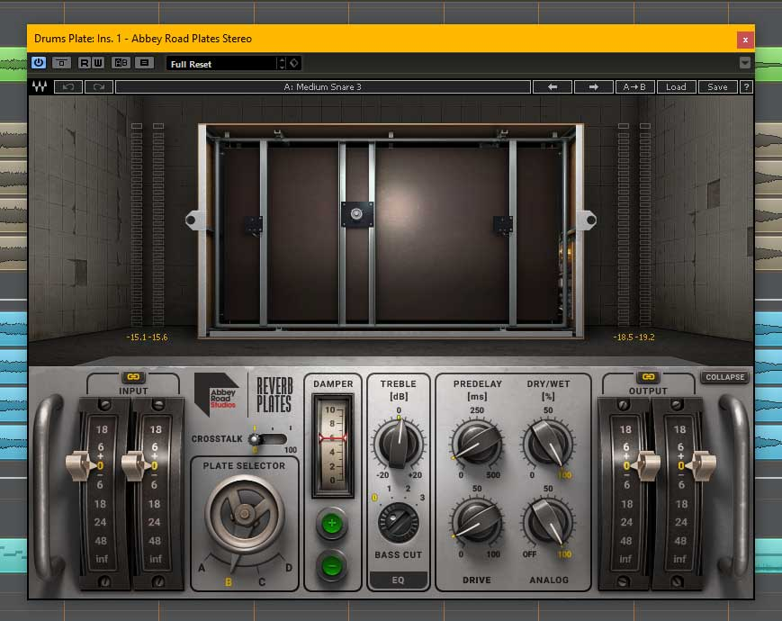
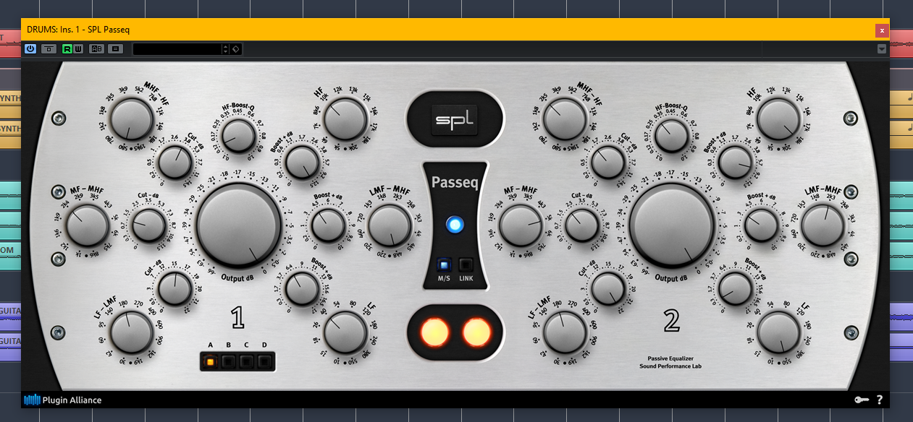
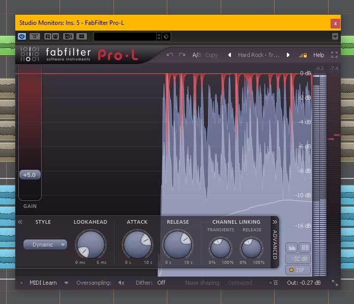

I've been mixing and mastering since 2011, and I've experimented with a large number of plugins. Over time I've noticed that I continually reach for a particular set of plugins. I've decided to compile a Top 10 list of my favourite ones.

> “This is by far my favourite plate reverb - it provides plenty of character that's great for livening up a vocal or a drum bus, and the controls are both intuitive and powerful, which make it a breeze for dialing in that perfect sound.”

The plugins I've chosen reflect what I currently own. I would have liked to include, for instance, some Universal Audio plugins but since I don't own an Apollo, I have opted not to include them in this list [I've not included any plugins that require hardware to run]. Likewise, there are several plugins that are virtually identical to that of another plugin company (for example, the LA-2A vintage compressor has been modeled by several companies), and I have chosen the version of that plugin in which I own.

I've also decide to not include any type of editing or repair plugin, such as a vocal tuner, or a click/noise reduction plugin, or a sample replacement tool. These are of great interest to me, but they do not fit the criteria and vibe of this particular blog post. I want to give a rundown of my favourite plugins that add character and flavour to my mixes and masters as opposed to providing a list of technical tools.

Of further interest to audio engineers with some extra spending money, I've included the cost of each plugin. I've provided its regular price if purchased solo and its lowest possible sale or bundle price (all prices listed in USD).

*NOTE: Please also note that the Waves plugin links are affiliate links (meaning I get a kickback for referring). This blog post was created several years before ever being a part of their referral program. You may need to disable your adblocker tool for the link to work.

Without further ado, here are 10 plugins that get used in almost every project I work on...

<strong>1) EQ: <a href="http://waves.alzt.net/7amDPO" target="_blank" rel="noopener">Waves API 560</a> [$249 reg/$59 on sale]</strong>

This bad boy is modeled after the classic API 560 10-band equalizer. What makes this EQ unique and especially musical is the "Proportional Q", which widens the filter bandwidth at lower boost/cut levels and progressively narrows at higher settings. This means that you can get quite surgical if you need a heavy boost/cut at certain frequencies or you can opt for a gentle boost/cut to preserve the natural tone of the instrument.

Furthermore, the 10 bands are divided into one-octave increments, which helps to prevent potential phasing issues and to enhances musicality and clarity. You're also able to switch polarity on the channel and you have the ability to decouple the analog characteristic of this plugin (turning it off removes that familiar API analog character).

I use this plugin on kicks, snares, guitars, vocals, pianos, synths, and more. It's my favourite EQ because it enables me to sculpt whatever sound I'm looking for with ease and precision.

<strong>2) Compressor: <a href="https://www.native-instruments.com/en/products/komplete/effects/vc-2a/" target="_blank" rel="noopener">Native Instruments VC-2A</a> [$99 solo/$66 Vintage Compressors bundle cost]</strong>

If you're looking for smooth natural compression then consider reaching for a vintage LA-2A style compressor. It's incredibly easy to use given its limited parameters. Most notable is the gain knob (output gain adjustment) and peak reduction knob, which in essence controls the threshold and amount of compression (more technically speaking, it adjusts the amount of signal being sent to the sidechain, which determines the amount of compression).

But its simplicity does not render it static and boring. The attack and release settings are level-dependent, meaning they vary in response to the input signal. If a high amount of input signal is fed into the compressor, the release characteristic will react to it where the first half of the release will be quite fast while the second half of the release is slower (think of an exponential graph). Effectively, the release characteristic can range from 40 ms to 15 s.

You can also select between two ratio settings; namely, compression (3:1) or limiting (100:1). There's also a high pass filter detector which will filter out low frequencies from triggering the compressor. And you have the ability to mix in the dry signal for parallel processing and the ability to use a sidechain input signal for getting that familiar ducking/pumping effect.

The result is smooth and silky compression with a touch of vintage warmth. This is my go to plugin for compressing vocals, strings, bass, synths and pads.

<strong>3) Filter: <a href="http://www.soundtoys.com/product/filterfreak/" target="_blank" rel="noopener">Soundtoys FilterFreak</a> [ $149 solo/$49 on sale]</strong>

This is a fantastic filter plugin. The filter characteristic is modeled after classic analog resonant filters which allow you to get silky smooth filter sweeps, or you can go for a classic resonant squelch, or even a wah-wah or sample-and-hold filter effect.

You can choose between 4 filter types; namely, Low Pass, Band Pass, High Pass, or Band Reject. The filter type can be tuned from a harsh 8 pole to a smooth sloped 2 pole. From there you can filter between a frequency range, add a subtle amount or a ton of resonance (or none), and blend in a dry/wet mix. This alone makes the plugin worthy of use in a mix.

What's more with this plugin is that you have the ability to modulate the filter frequency in some very unique ways. First and foremost, you can modulate the frequency range with an LFO (synced or not, with or without shuffling/swing). The more unique aspect is the ability to modulate the filtering with an Envelope triggered by the input signal. In effect, the modulation capabilities enable you to get wide ranging filter sweeps using an LFO, or funky resonant sounds that react to the input signal using envelope modulation. Not to mention you can even draw your own rhythmic patterns using the editor window (open it by pushing the tweak button).

Last but not least, this plugin has 7 different analog saturation styles to choose from (clean [no saturation], fat, squash, dirt, crunch, shred, pump, op-amp). Honestly, this plugin adds a whole lot more to the sound than just a simple amount of filtering. You can use this on a whole drum kit to warm it up and to add some cruch/punch, or you can filter a bassline and give it some funky resonant roll-off in the high-mids, or you can cleanly filter off your entire mix during a buildup or breakdown in the song, or you can create rhythmic high-pass filtering on a synth pad that matches the beat of the kick drum. You can add a lot of flavour and movement in your song with a just one or two instances of this plugin.

And as if one filter was not enough, this plugin actually comes in two forms: FilterFreak1, which I've depicted in this post, and FilterFreak2, which has the exact same functionality as the single filter, but allows you to blend two filters together either in series or in parallel (just think of the possibilities).

<strong>4) Stereo Enhancer: <a href="http://www.soundtoys.com/product/microshift/" target="_blank" rel="noopener">Soundtoys Microshift</a> [ $129 reg/$49 on sale]</strong>

This plugin is simple yet flavourful. It has pitch shifting and delay that varies over time, both of which help to provide a lot of depth and width to whatever you're processing.

The plugin is modeled after the classic Eventide H3000 hardware. You can choose between 3 different styles, you can high pass the processing and you can blend the dry and wet signals. All these controls allow you to dial in a variable amount of processing, anywhere between  very subtle and focused to full on chorused and uber wide.

The engineering behind this technique is rather simple; use variable pitch shifting to create a bit of chorus/phasing, add some variable delay to create some width and movement, and you've just turned your bland sounding instrument into something far more interesting. Soundtoys have taken the aforementioned engineering trick and distilled it into an easy to use interface with precise controls. I use this plugin a lot to emphasize important parts of the song (like supporting leads or background vocals during the chorus, for example). A subtle amount of processing on an acoustic guitar or a lead vocal sounds great too.

<strong>5) Delay: <a href="https://www.native-instruments.com/en/products/komplete/effects/replika/" target="_blank" rel="noopener">Native Instruments Replika</a> [$49 solo/FREE as a holiday gift in Dec 2014]</strong>

This plugin is loads of fun. Its controls are simple yet give you plenty of delay possibilities. Not to mention you can set the delays in ms, or sync them to your project's bpm/beat.

The modern delay mode offers pristine repeats while the vintage digital gives you that characteristic grit of old-school digital delays. The diffusion algorithm is a thing of its own; it's basically a cross between a delay and a reverb, providing gigantic edge-of-the-cliff sounds. You can also choose between a normal/mono, or wide/stereo, or ping pong delay.

The low cut and high cut filters are essential for cleaning up your repeats, the feedback control provides you with plenty of variability over the number of repeats and can be adjusted beyond 100% to get that familiar feedback crescendo. Lastly, the modulation section helps to provide subtle or intense motion to the wet signal.

I love this plugin, precisely for its simplicity and for its ability to produce a wide range of delay sounds. If I wanted to get a slap or tape delay I may reach for a different plugin, but this plugin is fantastic for warm vocal delays, for wide repeating ping-pong delays, and for huge out of this world diffuse delay/reverb effects.

<strong>6) Reverb: <a href="http://waves.alzt.net/DyVqoG" target="_blank" rel="noopener">Waves Abbey Road Reverb Plates</a> [$249 reg/$39 on sale]</strong>

This is by far my favourite plate reverb. Modeled after the EMT 140 plate reverb housed at Abbey Road Studios, this thing provides plenty character that's great for livening up a vocal or a drum bus, and the controls are both intuitive and powerful, which make it a breeze for dialing in that perfect sound.

You can choose between 4 different plates (A, B, C, D) which all have their own flavour. You can dial in some predelay, a perfect amount of damping (decay time), treble boost/cut, and remove some low frequencies if so desired (ranging from 10Hz to 1000Hz). There's also a drive knob that provides plenty of grit and character. The analog noise is decoupled so you can remove the natural noise of the original hardware if you're not into that.

This reverb has been used on countless recordings, many of which you would most certainly recognize (the Beatles, Pink Floyd, Radiohead and Adele). I spent many months trying to figure out if I was going to buy an Apollo just so I can get the EMT140 reverb plugin from UAD so it took me exactly zero time to get my hands on this plugin when Waves first released this plugin. I now find myself using it in nearly every project (typically used on drums and vocals, but occasionally on guitars and other stringed instruments).

<strong>7) Saturation: <a href="http://waves.alzt.net/195gx6" target="_blank" rel="noopener">Waves Kramer Tape</a> [$249 reg/$29 on sale]</strong>

Modeled after a rare vintage tube-powered reel-to-reel tape machine, this plugin offers plenty of character that leaves much to be desired.

The ability to choose between 7.5 and 15 IPS tape speeds, normal or over biasing, flux frequency range, wow and flutter amount, and input/output levels give you a wide range of tonal shaping capabilities. You can go from open and subtly distorted, to warm and gritty. To get more saturation turn up the flux and turn up the input so it drives the signal harder, or turn down the input and drive the output and you can achieve light amounts of saturation.

Not to mention there's a dedicated delay section that is fantastic for achieving that classic 40's slap delay sound. The noise from the original hardware device has been decoupled so you can mix in as much as you like, or remove the noise altogether.

I find myself using this plugin a lot on my guitar bus, for adding character to vocals and bass, and for adding grit and spice to my kicks and snares. I also works great on a drum bus since it reacts very well to the transients of the kicks and snares, it tames any harshness in the cymbals and it rounds out the overall sound in a pleasant way.

<strong>8) Compressor: <a href="http://waves.alzt.net/7amDYY" target="_blank" rel="noopener">Waves API 2500</a> [$299 reg/$29 on sale]</strong>

The API 2500 is a world renowned compressor simply because of its versatility in helping you shape the punch and tone of a mix with precision and control. There's a few key aspects of this compressor that makes it perfect for mastering and bus processing.

First you have the ability to switch between soft, medium, and hard knee which helps to control the onset of compression. The 3 thrust/tone modes provide the user with variable amounts of high pass filtering to the low, mid, and high frequencies on the RMS signal that triggers the compressor; this helps decrease low frequency pumping and increases the amount of compression to the high frequencies as you move from norm, to med, and to loud. Next you're able to choose between a feed forward (new) and feed back (old) style of signal source that is fed to the RMS detector [the F FWD setting is quite sensitive to transients while the F BACK setting seems to provide smoother compression].

Not to mention, the attack and release settings are incredibly fast on the 2500; you can go as fast as 0.03 ms & 0.05 ms respectively, which is great for mastering and for drum buses. You also have the option for selecting a variable release. There's also the ability for a variable amount of stereo linking or to process independently and added high/low pass filtering on said link control mixing which greatly helps to prevent any instruments on either the left or the right channels (say a panned floor tom or hand drum) from causing unwanted compression on its counterpart. And like many other analog modeled plugins by Waves, you have the ability to remove the analog characteristic of the original device.

All in all, this compressor is a total workhorse, primarily because there are unique features that give you a wide range of control over the punch and tone of your audio. I've been using this plugin since the day I bought it (likely around 2014), and it has served me well.

<strong>9) EQ: <a href="https://www.plugin-alliance.com/en/products/spl_passeq.html" target="_blank" rel="noopener">Plugin Alliance SPL Passeq EQ</a> [$249 reg/$149 on sale]</strong>

This EQ employs a similar boost/cut combination as the famous Pulteq passive EQ from the 50's & 60's. But the Passeq takes the Pultec to a whole new level. The Pultec allowed low and high frequency boost/cut while the Passeq adds a mid section. There's also 36 switchable frequencies in total while the Pultec only had 12. Employing this boost and cut combination to the low end results in a smooth, rounded, and rock solid low end, doing so to the mid section helps to clean up mid frequency honkiness while providing clarity and bite, and doing so to the highs enables you to roll off some of the brittle highs, which will give you a warmer tone; from there you can choose to add a bit of shimmer and air.

One of the best features of the plugin version of this EQ is the mid-side processing. You can easily sculpt a thumping low end, emphasize the wide elements of your mix, clean up the muddy frequencies, and add some presence and power with one instance of this plugin.

This EQ is both powerful and silky smooth which makes it excellent for mastering and for various bus groups (especially drums, guitars, and vocal groups). There is an aspect of clarity, control and musicality that makes me reach for this plugin for the final touches of my mixes/masters.

<strong>10) Limiter: <a href="https://www.fabfilter.com/products/pro-l-2-limiter-plug-in" target="_blank" rel="noopener">Fab Filter Pro-L</a> (now on version 2) [$199 solo/$98 Total Bundle cost]</strong>

I used to use the Waves L2 and L3 limiters, and by all means they get the job done. The L2 has a very 90's loud rock tone to it and the L3 added more flexibility and control over the dynamic processing which allowed for a variety of tones and limiting styles. But when I first tried the Pro-L limiter I was immediately blown away by how much loudness I could squeeze out of my masters without introducing any artifacts or distortion.

This plugin is extremely easy to use given the large number of presets (suitable for many different genres and styles of music/audio). Each preset offers a preview of the plugins ability to preserve transient peaks, or to preserve dynamic range, or to prevent pumping effects, etc. Simply choose a preset that sounds good, adjust the attack/release/linking to taste, choose your favourite limiting algorithms, set the gain to a comfortable level and you have yourself a professional sounding master that is clean, loud, punchy, and ready to be played on the radio.

Aside from the choice of four limiting algorithms (transparent, punchy, dynamic, and allround) and the ability to tweak attack and release times, you also have the ability to adjust lookahead time (larger lookahead time prevents unwanted distortion and artifacts). These three aspects offer a huge amount of flexibility and control which results in a wide range of achievable limiting styles. This plugin also allows you to adjust the amount of linking between channels at the transient and release stages of limiting (again, even more flexibility and control over how the limiting is effecting the audio). You can also activate the available linear-phase oversampling, which further reduces potential distortion and artifacts cause by extensive amounts of limiting.

The metering and visual feedback is another strong point of this plugin. You can change the size of the display (anything from no visual feedback to full screen mode), there is RMS loudness metering and True Peak metering (displays whether the audio will be clipped when it's rendered down to lossless .mp3 format). There's excellent visual representation of how the signal is being limited and exactly where that limiting is occurring. And you can use the on board dithering and noise shaping for that final professional touch.

All in all, this plugin has been my limiter of choice since about 2014. The Pro-L version 2 is out now and I'm ready for an upgrade.

##### Conclusion:

If I was lost at sea, shipwrecked onto a deserted island and was forced to use only 10 plugins for the rest of my life (forced by strict deserted island laws of course) I would be very comfortable and satisfied with the ones in this list. I know each plugin intimately and know that I can get the sound and character I so desire (which varies over time and depending on the project I'm working on). I may want an old 40's/50's vibe with slap delay, some saturation, and lots of dynamics. Or I might want a very tight and in-your-face mix for a metal/heavy rock song I'm working on. What's for certain is that each of these plugins are of high quality and purchasing them has proven to be a solid investment.

The list I've provided is but a fraction of what's available on the market but I hope what I've been able to do is provide a list that includes all important types of plugins in order to get a professional mix and master that's radio-ready. I also hope this list reflects the current market well. My aim was to choose a complimentary set of plugins and provide a detailed overview of what each of these plugins offers in terms of their functionality (the specific controls/parameters that make each plugin unique) or of their unique character. I hope I've helped you solidify your decision on whether these plugins are worth the investment. 

Please feel free to comment below indicating your go-to plugins and explain whether you agree or disagree with some of my choices.

If you'd like to learn how to [Profesionally Mix and Master](/education/) music, I offer personalized 1-on-1 training. I will put together a set of course topics and learning outcomes, chosen by you, such as the fundamentals of EQ, Compression, FX processing, Automation, and all the things that go into making professional quality mixes and masters.

I also offer [Mixing and Mastering Services](/mixing-mastering/). My expertise is in Indie Rock, Classic Rock, Hard Rock, and House Music, but I've been known to mix many other genres. I also offer unlimited revisions so that you are 100% satisfied.

##### Honourable mentions:
- Fab Filter Pro-Q3 [$179 solo/$88 Total Bundle cost]
- Native Instruments VC 76 [$99 solo/$66 Vintage Compressors bundle cost]
- Native Instruments VC 160 [$99 solo/$66 Vintage Compressors bundle cost]
- Native Instruments Passive EQ [$149 solo/$93 Premium Tube Series bundle cost]
- <a href="http://waves.alzt.net/09JnvY" target="_blank" rel="noopener">Waves Scheps 73 EQ</a> [$199 reg/$59 on sale]
- <a href="http://waves.alzt.net/7amDvV" target="_blank" rel="noopener">Waves Abbey Road Studio J37 Tape</a> [$299 reg/$29 on sale]
- <a href="http://waves.alzt.net/9LW97Y" target="_blank" rel="noopener">Waves H-Delay</a> [$179 reg/$49 on sale]
- Plugin Alliance Maag Audio EQ4 [$229 reg/$129 on sale]
- Soundtoys Decapitator [$199 reg/$49 on sale]
- Soundtoys EchoBoy [$199 reg/$49 on sale]
- Soundtoys LittlePlate [$99 reg/$49 on sale]
- Eventide H910 Harmonizer [$249 reg/$99 Anthology XI bundle cost]
- iZotope Ozone 8 & Neutron 2 Advanced Mastering Suite [$699 reg/$399 on sale/$250 with loyalty crossgrade]
