This post describes how to fix the following error message on an Akai S3000XL:

"waiting for hard disk ready.. SKIP" (pictured below)

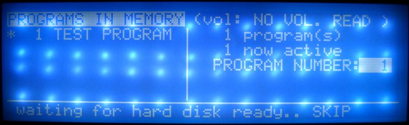
"waiting for hard disk ready.. SKIP" error message

#### What's Causing The Error Message

The most common reason for this error message is that the SCSI fuse is blown. ["SCSI is a set of standards for physically connecting and transferring data between computers and peripheral devices." source: <a href="https://en.wikipedia.org/wiki/SCSI" target="_blank" rel="noopener">wikipedia</a>]. Essentially, SCSI is the protocol that Akai used which allows you to connect to external hard disks. Instead of storing and retrieving your samples on floppy disks, you can store them on external hard drives.

#### The Fuse

This is the original soldered fuse you need to replace (it's already been removed when the picture was taken). You can replace it with an identical one, but it makes more sense to replace it with an easily replaceable glass fuse so that you don't have to re-solder a new one every time a fuse blows.

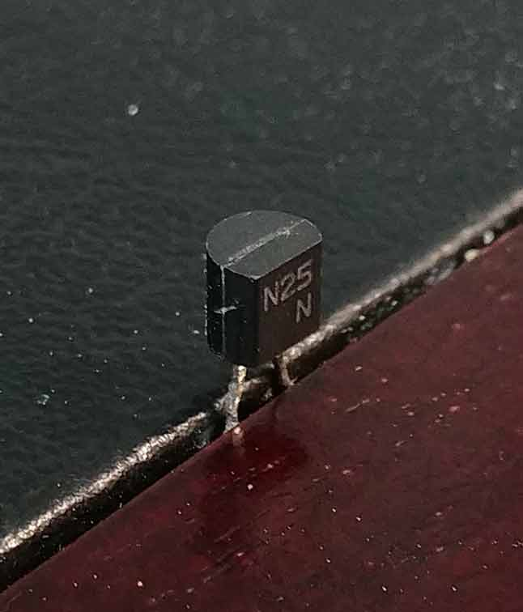
Original SCSI Soldered Fuse

The original fuse location is shown here

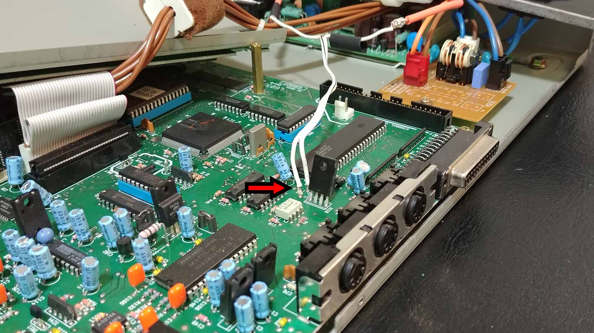
Location of the original SCSI fuse

#### The Tools And Parts

The tools and parts needed for the project are shown below.

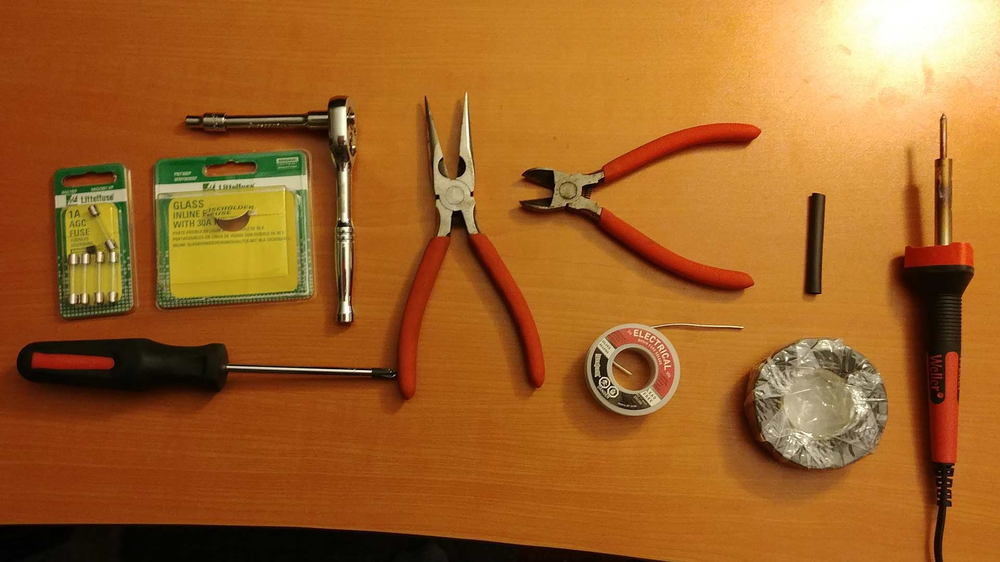
Not shown in the picture is the Glass Inline Fuse Holder and the 30 cm (1 foot) of wire (they were already installed when this picture was taken)

{/* #TODO fix the list item formatting!!! */}
Tools:
- Soldering Iron
- Solder
- Philips Screw Driver
- Ratchet with 5mm Socket (extension may be needed for easier access)
- Needle Nose Pliers
- Wire Cutters

Parts:
- 1A Glass Fuse
- Glass Fuse Holder

If the Glass Fuse Holder wires are not at least 30cm (1ft) long then you'll also need:
- 60cm (2ft) of 20 to 24 AWG gauge Electrical Wire
- or 30cm (1ft) of 20 to 24 AWG doubled Electrical Wire (2 independently insulated wires fused together with the insulation)
- Heat Shrink Tubing (or Electrical Tape)

This is the fuse holder you will be replacing the original Fuse with. Make sure you're replacing it using a 1A glass fuse. The fuse holder I bought came with a 30A fuse, which may result in electronic damage. To be safe, use a 1A glass fuse.

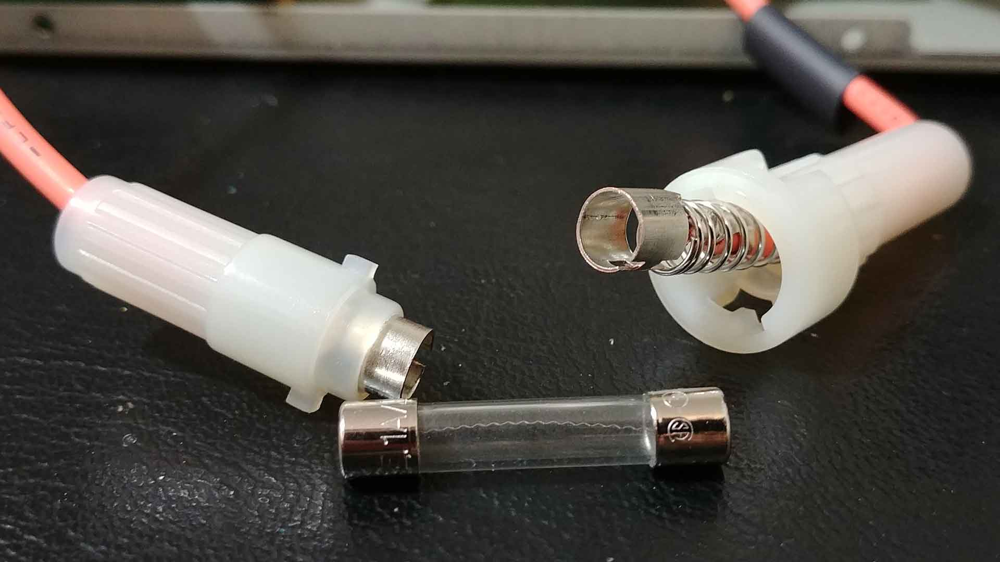
Replacement Glass Fuse Holder

#### How To Fix It:

First remove the top cover/casing. The picture below shows the top cover already removed. The red arrows point to the screw holes. I removed the screws from the outside.

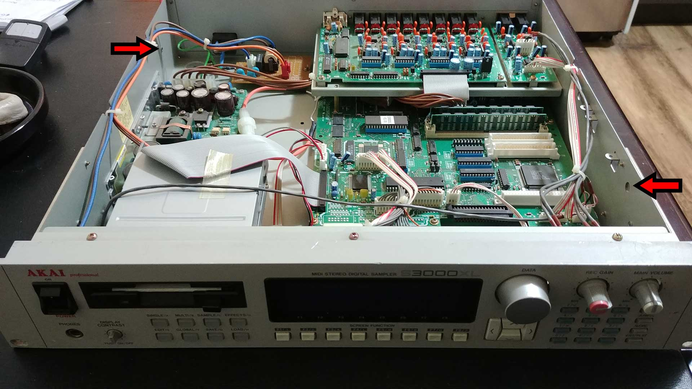
Front view of sampler. Top cover/case removed. Red arrows show screw holes.

There's two screws on either side of the unit:

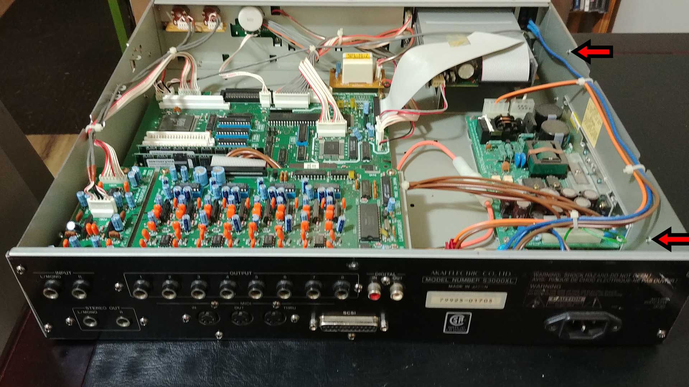
Rear view of sampler. Top cover/case removed. Red arrows show screw holes.

Take note of the circuit board containing outputs 1 through 8 shown below:

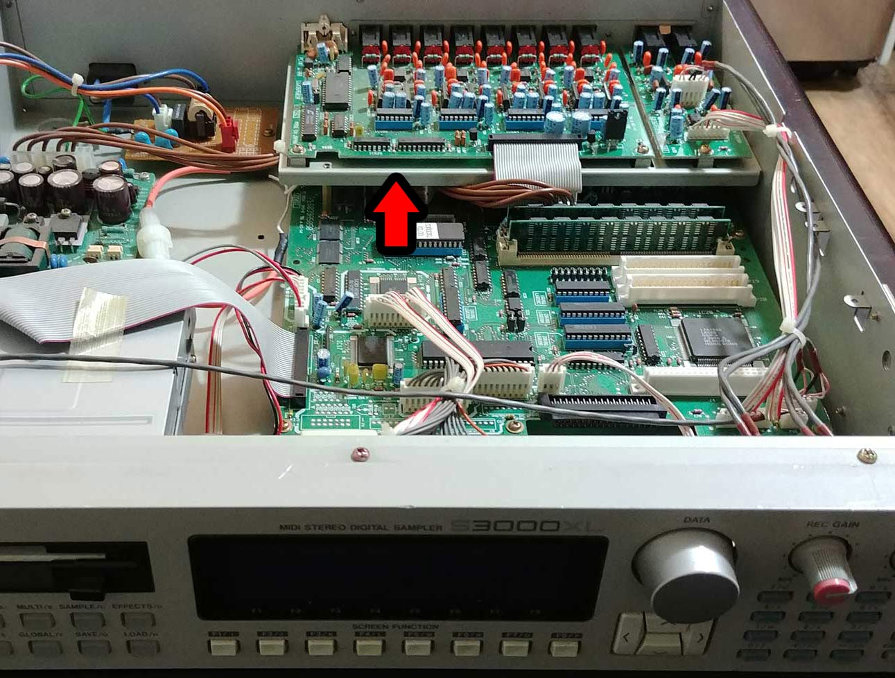
Red arrow shows Circuit Board containing audio outputs

This circuit board needs to be removed in order to access the blown fuse. Remove all of the screws that attach this circuit board to the rear panel:

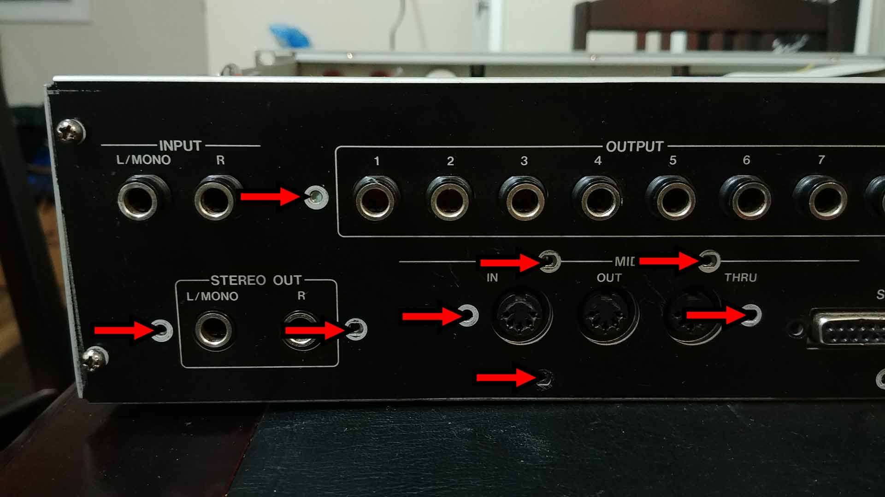
Rear panel. Red arrows show all screws/bolts/nuts needing removal.

Remove the power socket from the rear panel so you can remove the rear panel:

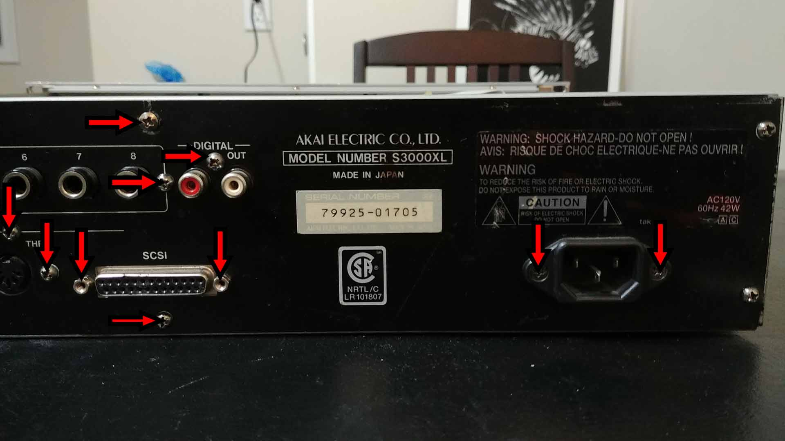
Rear panel. Red arrows show all screws/bolts/nuts needing removal.

Remove the 4 screws keeping the rear panel to the side panels:

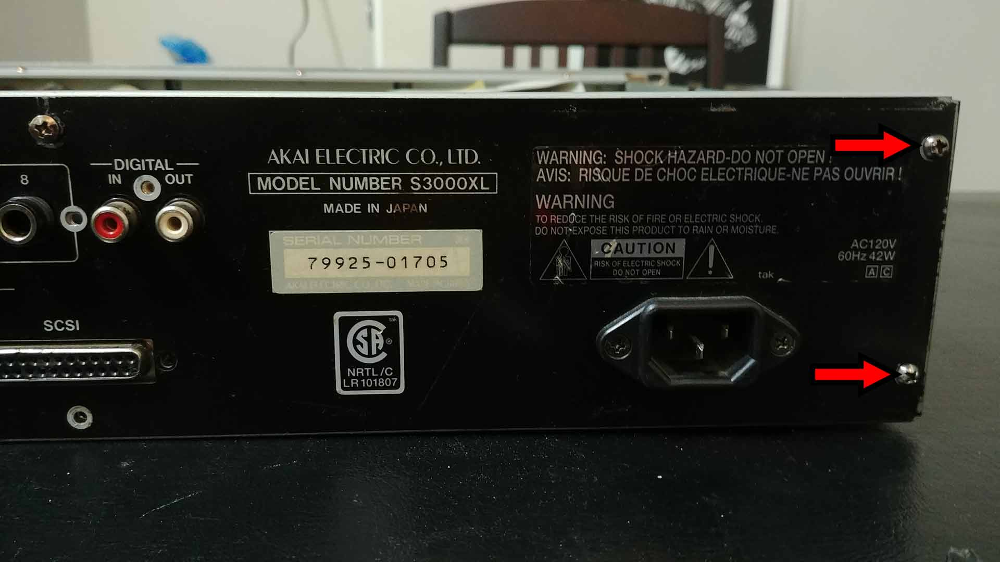
Rear panel. Red arrows show screws needing removal.

Once the circuit board is removed, you'll have access to the fuse. Removing the rear panel provides even greater access for soldering. Remove the fuse with the help of the soldering iron, and replace the fuse connections with 30cm (1 foot) of wire for each connection.

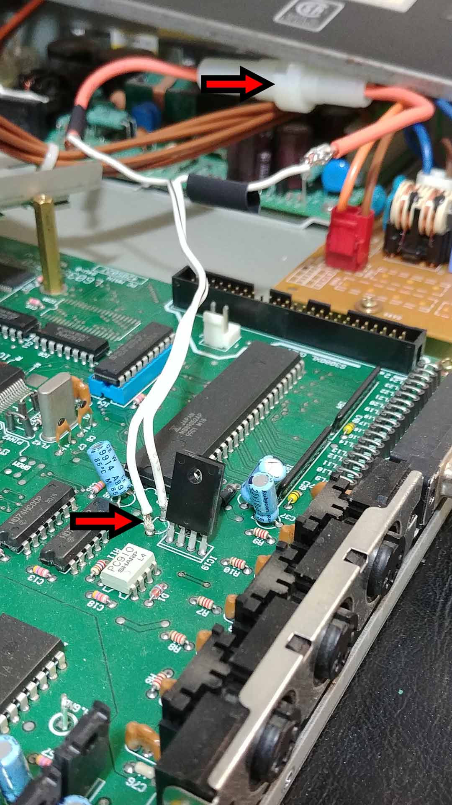
Main circuit board containing SCSI fuse. Red arrow shows Electrical Wire that replaces original fuse.

*(the following two steps are only required if your Glass Fuse Holder wires are less than 30cm/1ft long, like mine was):*

Make sure to solder the wire extension to the fuse holder as shown here:

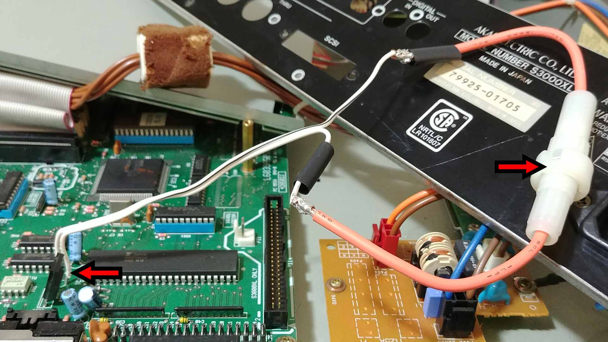
Glass Fuse Holder and Extension Wire soldered together and soldered to the Circuit Board

Make sure to use heat shrink tubing (or electrical tape) on any exposed wire like I've done. This will prevent any short circuits:

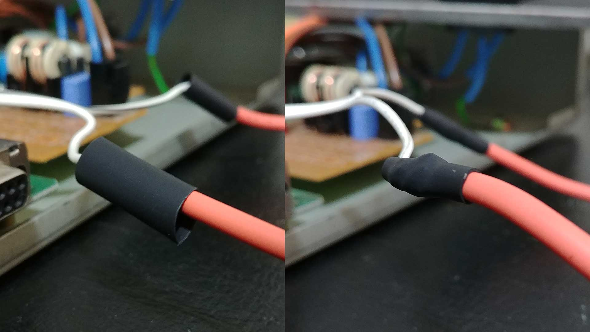
Heat shrink tubing used to prevent short circuiting

#### Reassembly

That completes the repair. Before re-installing the removed circuit board, you need to make sure the installed wire is neatly tucked below said removed circuit board. Tuck it like so:

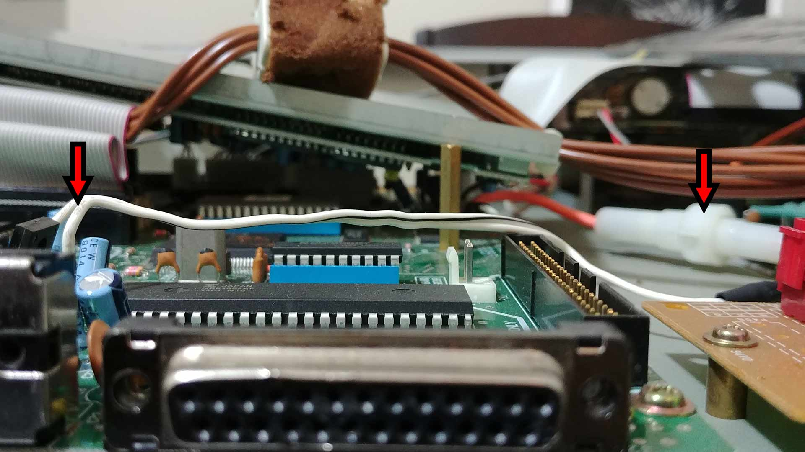
Wire extension tucked to allow room for removed Circuit Board

Now re-install the rear panel then the removed circuit board. Once complete the fuse holder will be freely available as shown:

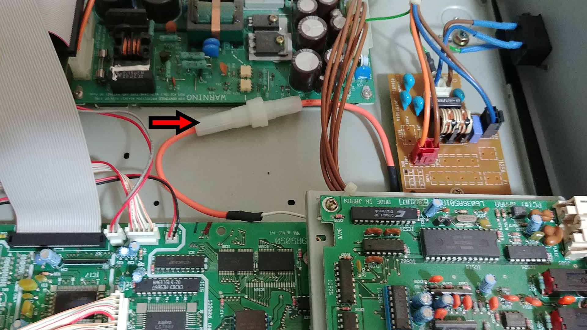
Glass Fuse Holder is easily accessible should another fuse blow

The rest is easy. Just re-install the remaining panels and screws in the reverse order that they were removed. You now have a repaired Akai S3000XL, and if the newly installed fuse should ever blow, all you have to do is remove 4 screws, take the top panel off, and replace the 1A glass fuse in the fuse holder, and away you go!

A big shout out to Gearslutz member "Don Solaris". His post is what helped me fix this error message on my Akai sampler. Here's a link to the original post: 
https://www.gearslutz.com/board/electronic-music-instruments-and-electronic-music-production/584170-scsi-samplers-tips-amp-solutions-4.html#post7218287 
