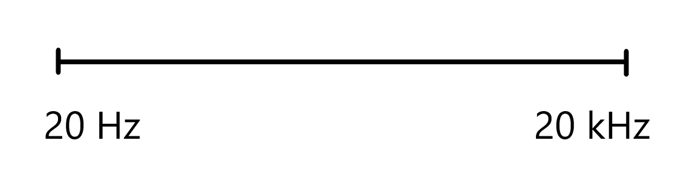
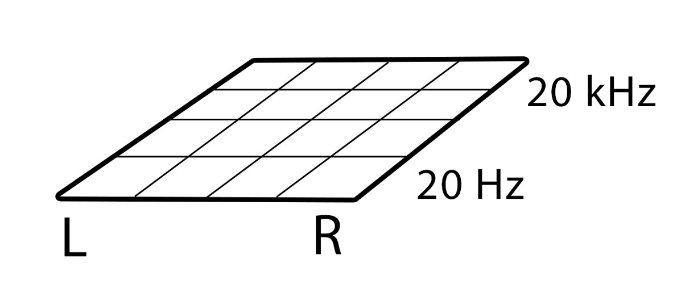
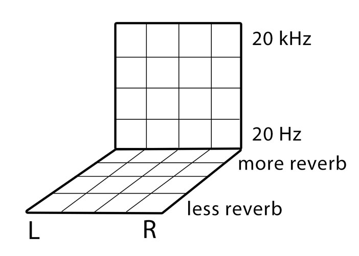

import EducationAndServicesPromo from "@/content/partials/EducationAndServicesPromo.mdx";

I want to discuss a mixing technique that I first learned from Graham (<a href="https://www.recordingrevolution.com/" target="_blank" rel="noopener">The Recording Revolution</a>); namely, “Mixing in Mono.” The suggestion is to monitor in mono while making volume, compression, and EQ decisions. To be more specific, once you've completed your initial adjustments in mono, flip back to stereo and see whether it made an improvement. By making critical decisions in mono, you are effectively going to make better decisions that will improve, not only mono compatibility (this is just a bonus) but you'll improve many aspects of your stereo mix.

But if nothing else, it's a good idea to flip back and forth between mono and stereo monitoring for the simple reason that it helps prevent baseline adaptation. Baseline adaptation is when your brain and auditory perception slowly adapt to your current listening environment to the point that everything sounds normal to you and your baseline perception of how things should sound has been re-established based on the current prolonged auditory stimulus. This means that if you listen to a sound source long enough, even if it was a terrible mix, you will adapt to it and it will start to sound normal, or god forbid it may start to sound good. By switching between mono and stereo, your brain has to re-establish a new baseline, which is a good thing when you're making mixing decisions. The same thing occurs when you take a 30 minute break, or switch to a different set of monitors, or switch between monitoring loud and quiet, or by using a reference mix.

I’m going to highlight some important points, the first being that when someone suggests you should mix in mono, it doesn’t mean that you should make all of your tracks mono. Let’s just get that one out of the way. Nor does it mean that you should mix your song while monitoring in mono from start to finish. It doesn’t even necessarily mean that you should make your song mono-compatible since that's not the goal. Mono-compatibility will be a by-product of using this mixing technique, but the more important goal is a better sounding stereo mix. When I and others suggest that you should mix in mono, it means that you should mix your song while monitoring in mono during certain stages of the mixing process; namely, during volume, compression, and EQ adjustments. By doing so, you're mix will, unsurprisingly, translate better in mono, but it will also translate better in stereo. The result is a punchier, wider, more detailed, more spacious and more balanced mix where one can more easily discern every element of the song. And who doesn't want that for their mixes?

Let's start by visualizing the elements of a mix. If an audio mixdown is completely mono, and we plotted it down to a frequency spectrum from 20Hz to 20kHz, we could think of this source as being a line segment. All elements of the mixdown would “fill” the frequency spectrum line segment in some way. Let’s call this line the “Frequency Spectrum Line." A bass guitar would have lots of low and low-mid frequencies while a vocal would have some low-mid frequencies and lots of mid to high frequencies. A mono mixdown can thus be thought of as a frequency spectrum line, where only a limited amount of frequencies from any given element of a song can occupy space on that line at any given time.

We can push the visual analogy further. If we had a stereo mixdown, we now have the very same frequency spectrum but spread over a second line segment (one point being 100% Left and the other 100% Right). If we think of the LR line being a horizontal line, we can think of the frequency spectrum as being a vertical line, where the lowest frequencies are at the bottom, and the higher frequencies are at the top. We now have a visual representation of both frequency spectrum and left and right spatial dispersion. We will call this the “Stereo Frequency Plane.” It’s essentially a 2D Square.

We can push the analogy even one step further. We can turn this 2D Square, or Stereo Frequency Plane, into a 3D Cube or what can be called the “Stereo Frequency and Depth Cube.” The way that we achieve depth in mixing is by having a variable amount of reverb and delay on different elements of the song. If you want something to sound upfront and “in your face” then you would try to have as little amount of reverb and delay (in the recording and in the mixdown) as possible, while if you want something to sound very distant you would use lots of reverb and/or delay. This analogy should help you visualize what I’m describing. Once I started visualizing audio sources in this way, my mixing experience has improved because I was no longer “mixing in the dark” so to speak. I had a lot more direction and made more purposeful mixing decisions that were punchier, had more clarity, and my mixes translated better to more playback devices.

Let's move to an example: If you have lots of tracks, and you plan on making volume adjustments, then you want to decide which elements need to be brought up or brought down, where and when to use automation, and possibly where to use fade ins and fade outs. If you were to make volume adjustments while monitoring in stereo and after you have applied some reverb and delay in your mix, then you are listening for volume changes within this Stereo Frequency and Depth Cube. If you were to instead making volume adjustments while monitoring in mono and before any application of reverb or delay, then you would be listening for volume changes within a Frequency Spectrum Line rather than a Plane or a Cube. It’s much simpler and easier to work within a one dimensional space as opposed to a two or three dimensional space.

Compression mixing decisions are quite similar. You are basically trying to hear the dynamics and differences in volume between all of the elements in the song. You are deciding what elements need compression and which do not. Moreover, you need to make several specific adjustments using many different settings (like attack, release, threshold, ration, etc). If you mix Compression in Mono, you will hear all elements of the song coming out of all speakers as one source, and it’s easier to hear what’s too quiet or too loud, what needs more compression or less compression, whether to increase or decrease attack and release settings, etc. Making compression decisions in stereo will only further complicate the process.

Making EQ decisions is similar in many ways, but slightly different. You’re basically trying to carve out a space for each element of the song. Depending on the song, you may need to carve out a lot of space and apply lots of EQing, or you may need to do very little. If you make EQ decisions while monitoring in stereo, then it will be more difficult to hear which elements are clashing and in what frequencies because you are making those decisions while monitoring a Stereo Frequency Plane. On the other hand, making those decisions while monitoring in Mono will put all the elements and all frequencies of the entire song into a  single unit, one single wall of sound (a Frequency Spectrum Line). It’s easier to carve out a space for each element of the song when you are listening to a Frequency Spectrum Line than a Stereo Frequency Plane.

Once you’ve carved out a space in the Frequency Spectrum Line for every element of the song while monitoring in mono, then go ahead and pan some of those elements along the Stereo Field while monitoring in stereo. I can guarantee that you will be impressed with the results. For example, if you EQ a L and R guitar to sound good while monitoring in mono so that you can hear both L and R guitars clearly, then they will sound noticeably better while monitoring in stereo than if you were to EQ your stereo guitars while monitoring in stereo. If you don’t believe me then try it out for yourself.

Keep in mind that I don't want to oversimplify the mixing process. I simply want to point out that if you make the bulk of your volume adjustments, compression and EQ decisions while monitoring in mono and before applying reverb and other FX then the decisions that you end up making will result in a punchier, wider, and more detailed mix. A natural result from mixing in this way is that your mix will translate better in stereo and as a bonus will translate better to mono playback systems. Mono compatibility in this case is just a by-product and a  bonus. You can always mix in a particular way that will enhance mono compatibility even further, but that is up to you. I prefer to make my mixes sound as awesome as possible as a stereo mixdown and played on stereo systems. By applying mono compatibility in the way that I've described, your mixes will simply translate better to all stereo and mono playback systems. At least that is what I’ve noticed when I began implementing the ideas and techniques of this blog post to my mixes.

Furthermore, there will always be a point in the mixing process where your song is almost finished, but you want to make further adjustments. Say you have most elements of the song adjusted in volume, compressed, EQ’d, panned, and you’ve already applied FX like delay and reverb and begun to make automation decisions. But you want to add more FX or change things up a bit. At this point in the mixing process, it still makes sense to make  changes while monitoring in mono. Do a few changes and then flip back and forth between mono and stereo monitoring. Have a good listen at how things are changing in mono and see if those changes translate well in stereo.

And lastly, you will want to listen to your mix and make the very last changes to your mix when monitoring in stereo if your mix is intended to be listened to in stereo. The main point of this blog post was to introduce you to the concept of “Mixing in Mono” and to get you thinking about why it's an effective tool and why you would want to implement it in your mixing routine. But take this mixing advice with a grain of salt, since it would seem foolish to me if you were to take this mixing technique to its logical extreme; namely, if you were to only ever mix in mono from start to finish and never make mixing decisions in stereo. There will always be certain points of the mixing process that require you to monitor in stereo (the most obvious and most important being panning). There’s only one way to hear what a final mixdown actually sounds like in stereo, and that’s by monitoring in stereo! So put this Mixing in Mono advice to the test, and see whether or not it helps you achieve better mixes.

<EducationAndServicesPromo />
