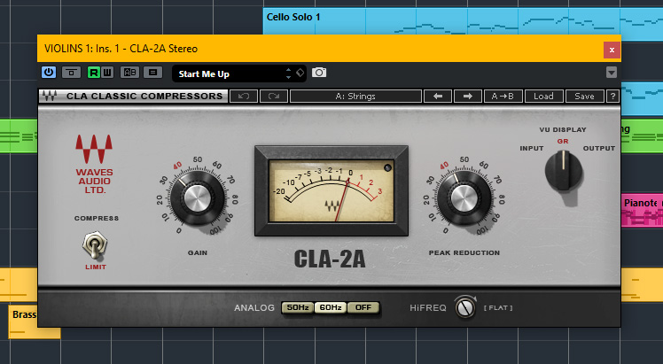
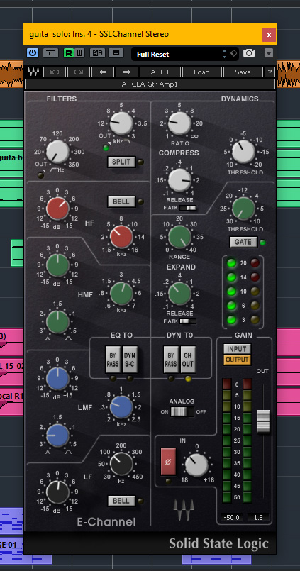
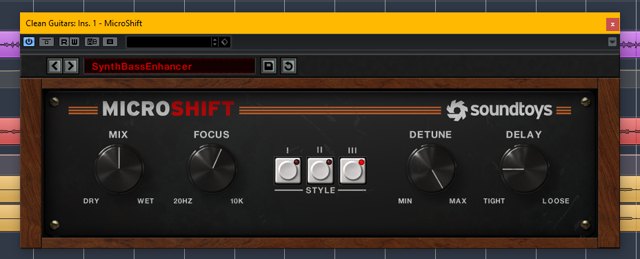
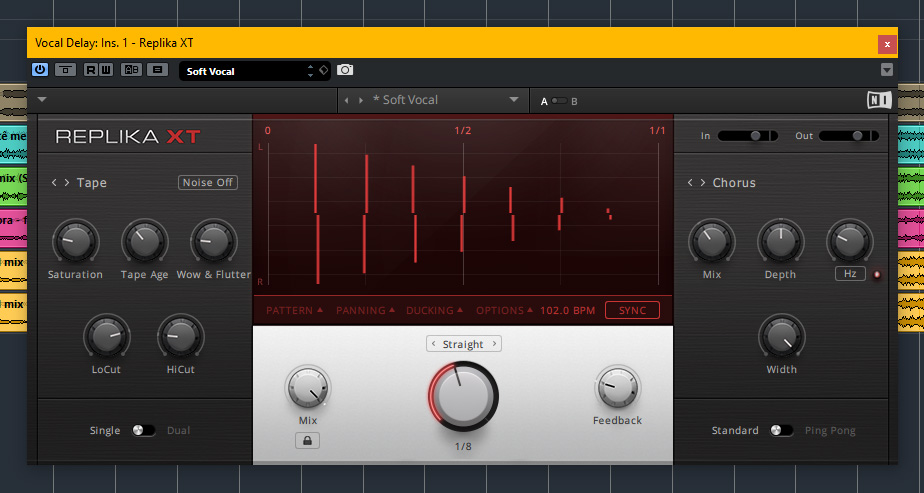
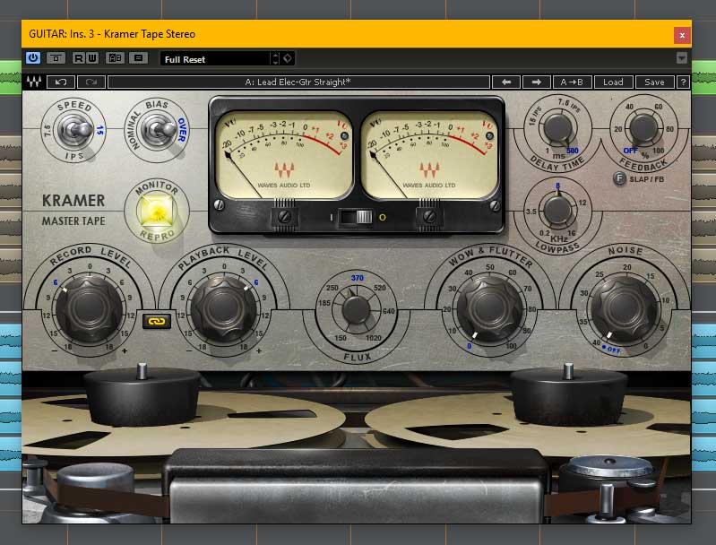
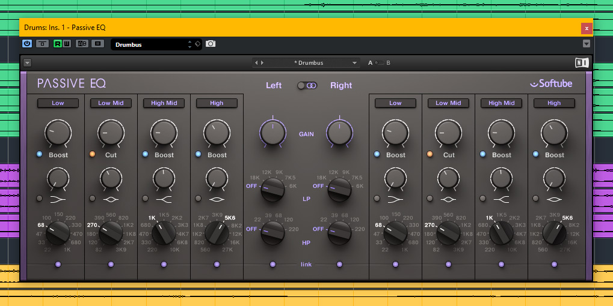
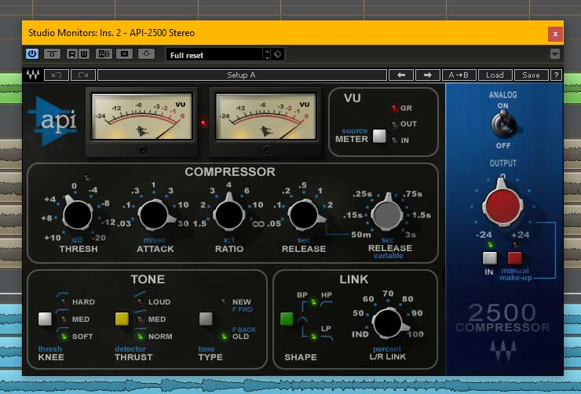

I made a similar post in 2018 but my choice of mixing and mastering plugins has changed a bit. I've had more time to acquire new plugins as well as test competitor plugins (such as Native Instruments VC-2A versus Waves CLA-2A) and decided to revise my initial selection, although many of the plugins remain from my original list.

The plugins I've chosen reflect what I currently own. I would have liked to include, for instance, some Universal Audio plugins but since I don't own an Apollo or a Satellite, I have opted not to include them in this list [I've not included any plugins that require hardware to run]. As mentioned in the intro, there are several plugin companies that model the same hardware unit (for example, the LA-2A vintage compressor), and I have chosen what I believe to be the higher quality manufacture of that modeled plugin.

Just like my previous post, this list will not include any type of editing or repair plugins, such as a vocal tuner, or a click/noise reduction plugin, or a sample replacement tool. I want to give a rundown of my favourite plugins that add character and polish to my mixes as opposed to providing a list of technical tools.

I've also included the cost of each plugin, both the regular price if purchased solo and its lowest possible sale or bundle price (all prices listed in USD). 

*NOTE: Please also note that the Waves plugin links are affiliate links (meaning I get a kickback for referring). This blog post was created several years before ever being a part of their referral program. You may need to disable your adblocker tool for the link to work.

Without further ado, here are 10 plugins that I use in almost every project...

<strong>1) EQ: <a href="http://waves.alzt.net/7amDPO" target="_blank" rel="noopener">Waves API 560</a> [$249 reg/$59 on sale]</strong>

  <iframe 
    style="position: absolute; top: 0; left: 0; width: 100%; height: 100%;"
    src="https://www.youtube.com/embed/r73o1eutkSI" 
    title="YouTube video player" 
    frameborder="0" 
    allow="accelerometer; autoplay; clipboard-write; encrypted-media; gyroscope; picture-in-picture" 
    allowfullscreen>
  </iframe>

This plugin is modeled after the classic API 560 10-band equalizer. What makes this EQ unique and especially musical is the "Proportional Q", which widens the filter bandwidth at lower boost/cut levels and progressively narrows at higher settings. This means that you can get quite surgical if you need a heavy boost/cut at certain frequencies or you can opt for a gentle boost/cut to preserve the natural tone of the instrument.

Furthermore, the 10 bands are divided into one-octave increments, which helps to prevent potential phasing issues and to enhances musicality and clarity. You're also able to switch polarity on the channel and you have the ability to decouple the analog characteristic of this plugin (turning it off removes the noise and harmonic distortions produced by the API analog circuitry).

I use this plugin on kicks, snares, guitars, vocals, pianos, synths, and more. It's my favourite EQ because it enables me to sculpt whatever sound I'm looking for with ease and precision.

<strong>2) Compressor: <a href="http://waves.alzt.net/BnXG4B" target="_blank" rel="noopener">Waves CLA-2A</a> [$249 reg/$29 on sale]</strong> 

If you're looking for smooth natural sounding compression then consider reaching for a vintage LA-2A style compressor. It's incredibly easy to use given its limited parameters. Most notable is the gain knob (output gain adjustment) and peak reduction knob, which in essence controls the threshold and amount of compression (more technically speaking, it adjusts the amount of signal being sent to the sidechain, which determines the amount of compression).

But its simplicity does not render it static and boring. The attack and release settings are level-dependent, meaning they vary in response to the input signal. If a high amount of input signal is fed into the compressor, the release characteristic will react to it where the first half of the release will be quite fast while the second half of the release is slower (think of an exponential graph). Effectively, the release characteristic can range from 40 ms to 15 s.

You can also select between two ratio settings; namely, compression (3:1) or limiting (100:1). There's also a high pass filter detector which will filter out low frequencies from triggering the compressor. And you have the ability to remove or enable some analog noise floor and hum, based on the power supplies of the original units at either 50Hz or 60Hz.

The result is smooth and silky compression with a touch of vintage warmth. This is my go to plugin for compressing vocals, strings, bass, synths and pads.

*(note: Originally I had chosen the Native Instruments VC 2A version of the plugin. I did some fairly extensive comparisons between it and the Waves CLA-2A. And I've got to say that the Native Instruments version is more likely to have pumping artifacts that can make it more difficult to achieve consistent "up front" compression. It's great that you can mix in the dry signal, thus giving you the ability to add parallel compression, but alas I've come to prefer the Waves plugin as I find it works better for compressing a lead vocals or similar instruments that needs a large reduction in dynamics and need to stay front and center in the mix. I'll make a video demonstrating my findings in the near future.)*

<strong>3) Channel Strip: <a href="http://waves.alzt.net/EEax4W" target="_blank" rel="noopener">Waves SSL E-Channel</a> [ $249 solo/$35 on sale]</strong> 

This plugin has it all. It has a great analog modeled 4 band EQ, a powerful and effective dynamics processor section, and a pair of filters, but it also has some flexible routing capabilities. For instance, when you engage the "split" button in the filter section, the filters will be placed before the dynamics processors (a disengaged "split" button puts the filter after the dynamics section). This gives you the flexibility of choosing whether to remove some low or high frequencies that may cause unwanted pumping artifacts by triggering the compressor uncontrollably. You can also choose the position of the EQ section. So you can have one of 3 setups: Dyn > Fltr > EQ, or Fltr > EQ > Dyn, or Fltr > Dyn > EQ.

The filters are very musical and so are all the EQ bands. You can get some very surgical results if needed, using the wide to narrow Q adjustments. But the EQ doesn't sound surgical or stale, it sounds very natural and pleasing, even at high boosts and cuts. You can also choose between a shelf or bell setting for the high and low frequency bands.

The compression is very smooth. That may be due in part from its auto-sensing attack (when fast attack is not engaged the attack settings may vary as it's program dependent). The fast attack setting is a super fast 1 ms. The release settings can be set between 0.1 sec to 4 seconds. The Gate section has the same attack and release settings. Compression ratio can be set from 1 to infinity (limiting).

You can also enable the EQ to "Dyn S-C-" button which enables the filters and EQs into the dynamics sidechain, which allows for some simple de-essing. And there's also a handy phase reverse button, in case your DAW doesn't already have one for each channel. All in all this is a great all around channel plugin.

<strong>4) Stereo Enhancer: <a href="http://www.soundtoys.com/product/microshift/" target="_blank" rel="noopener">Soundtoys Microshift</a> [ $129 reg/$49 on sale]</strong>

This plugin is simple but very useful. It has pitch shifting and delay that varies over time, both of which help to provide a lot of depth and width to whatever you're processing.

The plugin is modeled after the classic Eventide H3000 hardware. You can choose between 3 different styles, you can high pass the processing and you can blend the dry and wet signals. All these controls allow you to dial in a variable amount of processing, anywhere between  very subtle and focused to full on chorused and uber wide.

The engineering behind this technique is rather simple; use variable pitch shifting to create a bit of chorus/phasing, add some variable delay to create some width and movement, and you've just turned your bland sounding instrument into something far more interesting. Soundtoys have taken the aforementioned engineering trick and distilled it into an easy to use interface with precise controls. I use this plugin a lot to emphasize important parts of the song (like supporting leads or background vocals during the chorus, for example). A subtle amount of processing on an acoustic guitar or a lead vocal sounds great too.

<strong>5) Delay: <a href="https://www.native-instruments.com/en/products/komplete/effects/replika/" target="_blank" rel="noopener">Native Instruments Replika</a> [$99 solo/$49 for owners of Replika]</strong>

This is the expanded version of the original Replika, with 2 additional delay modes, 5 additional modulation effects, and more in depth parameters to tweak like delay ducking, shuffle/feel/accent, and choosing between single delay, or dual serial, or dual parallel (which are all musically distinct). The controls are simple and intuitive but give you plenty of delay possibilities.

The modern delay mode offers pristine repeats while the vintage digital gives you that characteristic grit of old-school digital delays. The analog delay provides darker and warmer repeats, while the tape provides organic yet punchy smooth echoes. The diffusion algorithm is a thing of its own; it's basically a cross between a delay and a reverb, providing gigantic edge-of-the-cliff sounds. You can also choose between a normal/mono, or wide/stereo, or ping pong delay for any of these delay types.

The great thing about each delay modes is that they have their own dedicated controls. For instance, the tape delay has an adjustable amount of wow & flutter, while the analog delay has 4 bucket brigade delay (BBD) types, namely clean, warm, dark, and grunge. The modern delay has a saturation knob, while the digital delay has 4 audio quality types (high, medium, low, and crunch).

The low cut and high cut filters are essential for cleaning up your repeats, the feedback control provides you with plenty of variability over the number of repeats and can be adjusted beyond 100% to get that familiar feedback crescendo. The delay time can be set in ms, or synced to your project BPM as straight, dotted, or triplet between 1/64th and 2/1. You have a wide variety of panning options (Pan dry, pan wet, width, L/R ofset). And lastly, you can choose between 7 modulation types (phaser, flanger, chorus, freq shifter, filter, pitch shifter, micro pitcher) that can help create subtle or intense motion to the wet signal.

I love this plugin, precisely for its flexibility and for its wide range of parameters that give you direct control over the nature of the repeats. I may decide to reach for a delay that specializes in a given characteristic sound, such as the Waves H-Delay to get a recognizable filtered analog slapback, but the Replika XT is equally capable. Moreover, it's not a one trick pony, and it is certainly not a jack of all trades and master of none. Each delay type is distinct and can be dialed in with precision, for a wide range of sounds that are all very musical.

<strong>6) Reverb: <a href="http://waves.alzt.net/DyVqoG" target="_blank" rel="noopener">Waves Abbey Road Reverb Plates</a> [$199 reg/$29 on sale]</strong>

This is one of my favourite reverb plugins for drums, guitars, pianos, and vocals. Modeled after the EMT 140 plate reverb housed at Abbey Road Studios, this thing provides plenty character that's great for livening up a vocal or a drum bus, and the controls are both intuitive and powerful, which make it a breeze for dialing in a great sound.

You can choose between 4 different plates (A, B, C, D) which all have their own flavour. You can dial in some predelay, a perfect amount of damping (decay time), treble boost/cut, and remove some low frequencies if so desired (ranging from 10Hz to 1000Hz). There's also a drive knob that provides plenty of grit and character. The analog noise is decoupled so you can remove the natural noise of the original hardware if you're not into that.

This reverb has been used on countless recordings, many of which you would most certainly recognize (the Beatles, Pink Floyd, Radiohead and Adele). I spent many months trying to figure out if I was going to buy an Apollo just so I can get the EMT140 reverb plugin from UAD so it took me exactly zero time to get my hands on this plugin when Waves first released this plugin. I now find myself using it in nearly every project (typically used on drums and vocals, but occasionally on guitars and other stringed instruments).

<strong>7) Saturation: <a href="http://waves.alzt.net/195gx6" target="_blank" rel="noopener">Waves Kramer Tape</a> [$249 reg/$29 on sale]</strong>

Modeled after a rare vintage tube-powered reel-to-reel tape machine, this plugin offers plenty of character that leaves much to be desired.

The ability to choose between 7.5 and 15 IPS tape speeds, normal or over biasing, flux frequency range, wow and flutter amount, and input/output levels give you a wide range of tonal shaping capabilities. You can go from open and subtly distorted, to warm and gritty. To get more saturation turn up the flux and turn up the input so it drives the signal harder, or turn down the input and drive the output and you can achieve light amounts of saturation.

Not to mention there's a dedicated delay section that is fantastic for achieving that classic 40's slap delay sound. The noise from the original hardware device has been decoupled so you can mix in as much as you like, or remove the noise altogether.

I find myself using this plugin a lot on my guitar bus, for adding character to vocals and bass, and for adding grit and spice to my kicks and snares. I also works great on a drum bus since it reacts very well to the transients of the kicks and snares, it tames any harshness in the cymbals and it rounds out the overall sound in a pleasant way.

<strong>8) EQ: <a href="https://www.native-instruments.com/en/products/komplete/effects/passive-eq/" target="_blank" rel="noopener">Native Instruments Passive EQ</a> [$149 solo/$93 Premium Tube Series bundle cost]</strong> 

The Native Instruments Passive EQ is modeled after the Manley Massive Passive, which employs similar passive circuitry as the famous Pulteq passive EQ from the 50's & 60's. But the Massive Passive was more than a spin off of the Pultec. It took all the best features of the Pultec EQ, from select console EQ's, and of parametric and graphic equalizers.

The Pultec allowed low and high frequency boost/cut combinations, while the Massive Passive has 4 dedicated parametric frequency bands that can all be switched between a shelf or bell to a maximum of 20dB of boost or cut. Each band has 11 possible frequencies to choose from. In addition there are dedicated high pass and low pass filters, each having 5 frequency points. The low pass filter slope increases as the frequency increases from an initial 18dB/octave to 24dB/octave and finally 60dB/octave. 

You can easily employ the same boost and cut combinations as the Pulteq to get a smooth, rounded, and rock solid low end, or to get a crisp and clear mid range while reducing honkiness. And unsurprisingly, you can polish your tracks up by rolling off some of the brittle highs, or even go a step further to get a warmer tone; from there you can choose to add a bit of shimmer and air.

One of the best features of Native Instruments Passive EQ version is the mid-side processing. You can easily sculpt a thumping low end, emphasize the wide elements of your mix, clean up the muddy frequencies, and add some presence and power with one instance of this plugin.

This EQ is both powerful and silky smooth which makes it excellent for mastering and for various bus groups (especially drums, guitars, pianos, and vocal groups). There is an aspect of clarity, control and musicality that makes me continuously reach for this plugin for the final touches of my mixes/masters.

*(note: Originally I had chosen the Plugin Alliance SPL Passeq EQ, which is a very similar style of EQ, given it's passive nature and wide array of frequency choices. However, over time I found myself wanting a bit more heavy handed coloration on a dry sounding drum bus, or sterile sounding piano. I found the Passeq EQ to be more surgical in nature, making it better for preserving the natural tone and characteristic of the originating audio source, and more useful as a final balancing tool during mastering. For that my preference has shifted to the Passive EQ, where I can impart some pleasant coloration, while still remaining subtle if needed. However, sometimes the originating audio source is already very colourful and will be easily overdone by even the slightest boosts and cuts with the Passive EQ. I've yet to try the Universal Audio version as well as the original hardware unit so perhaps that's simply a Native Instruments issue.)*

<strong>9) Bus Compressor: <a href="http://waves.alzt.net/7amDYY" target="_blank" rel="noopener">Waves API 2500</a> [$299 reg/$29 on sale]</strong>

The API 2500 is a world renowned compressor simply because of its versatility in helping you shape the punch and tone of a mix with precision and control. There's a few key aspects of this compressor that makes it perfect for mastering and bus processing.

First you have the ability to switch between soft, medium, and hard knee which helps to control the onset of compression. The 3 thrust/tone modes provide the user with variable amounts of high pass filtering to the low, mid, and high frequencies on the RMS signal that triggers the compressor; this helps decrease low frequency pumping and increases the amount of compression to the high frequencies as you move from norm, to med, and to loud. Next you're able to choose between a feed forward (new) and feed back (old) style of signal source that is fed to the RMS detector [the F FWD setting is quite sensitive to transients while the F BACK setting seems to provide smoother compression].

Not to mention, the attack and release settings are incredibly fast on the 2500; you can go as fast as 0.03 ms & 0.05 ms respectively, which is great for mastering and for drum buses. You also have the option for selecting a variable release. There's also the ability for a variable amount of stereo linking or to process independently and added high/low pass filtering on said link control mixing which greatly helps to prevent any instruments on either the left or the right channels (say a panned floor tom or hand drum) from causing unwanted compression on its counterpart. And like many other analog modeled plugins by Waves, you have the ability to remove the analog characteristic of the original device.

All in all, this compressor is a total workhorse, primarily because there are unique features that give you a wide range of control over the punch and tone of your audio. I've been using this plugin since the day I bought it (likely around 2014), and it has served me well.

<strong>10) Limiter: <a href="https://www.fabfilter.com/products/pro-l-2-limiter-plug-in" target="_blank" rel="noopener">Fab Filter Pro-L</a> (now on version 2) [$199 solo/$98 Total Bundle cost]</strong>

I used to use the Waves L2 and L3 limiters, and by all means they get the job done. The L2 has a very 90's loud rock tone to it and the L3 added more flexibility and control over the dynamic processing which allowed for a variety of tones and limiting styles. But when I first tried the Pro-L limiter I was immediately blown away by how much loudness I could squeeze out of my masters without introducing any artifacts or distortion.

This plugin is extremely easy to use given the large number of presets (suitable for many different genres and styles of music/audio). Each preset offers a preview of the plugins ability to preserve transient peaks, or to preserve dynamic range, or to prevent pumping effects, etc. Simply choose a preset that sounds good, adjust the attack/release/linking to taste, choose your favourite limiting algorithms, set the gain to a comfortable level and you have yourself a professional sounding master that is clean, loud, punchy, and ready to be played on the radio.

Aside from the choice of four limiting algorithms (transparent, punchy, dynamic, and allround) and the ability to tweak attack and release times, you also have the ability to adjust lookahead time (larger lookahead time prevents unwanted distortion and artifacts). These three aspects offer a huge amount of flexibility and control which results in a wide range of achievable limiting styles. This plugin also allows you to adjust the amount of linking between channels at the transient and release stages of limiting (again, even more flexibility and control over how the limiting is effecting the audio). You can also activate the available linear-phase oversampling, which further reduces potential distortion and artifacts cause by extensive amounts of limiting.

The metering and visual feedback is another strong point of this plugin. You can change the size of the display (anything from no visual feedback to full screen mode), there is RMS loudness metering and True Peak metering (displays whether the audio will be clipped when it's rendered down to lossless .mp3 format). There's excellent visual representation of the gain reduction and exactly where that limiting is occurring. And you can use the on board dithering and noise shaping for that final professional touch.

All in all, this plugin has been my limiter of choice since about 2014. The Pro-L version 2 is out now and I have still not upgraded. Not because I don't think it's worth it, but simply that version 1 was so well done that I'll probably never need to upgrade (my bank account approves this message).

EDIT: I've upgraded to Pro-L version 2 since the original publishing of this blog post. Even though I joked about not spending the money, Fab Filter had a sale that made the upgrade that much more enticing. Version 2 has several new features (such as True Peak limiting, new limiting algorithms, new presets, and more). There are also improvements to the UI experience, so overall it's definitely worth the upgrade.

##### Conclusion:

If I was lost at sea, shipwrecked onto a deserted island and was forced to use only 10 plugins for the rest of my life (forced by strict deserted island laws of course) I would be very comfortable and satisfied with the ones in this list. I know each plugin intimately and know that I can get the sound and character I so desire (which varies over time and depending on the project I'm working on). I may want an old 40's/50's vibe with slap delay, some saturation, and lots of dynamics. Or I might want a very tight and in-your-face mix for a metal/heavy rock song I'm working on. What's for certain is that each of these plugins are of high quality and purchasing them has proven to be a solid investment.

The list I've provided is but a fraction of what's available on the market but I hope what I've been able to do is provide a list that includes all important types of plugins in order to get a professional mix and master that's radio-ready. I also hope this list reflects the current market well. My aim was to choose a complimentary set of plugins and provide a detailed overview of what each of these plugins offers in terms of their functionality (the specific controls/parameters that make each plugin unique) or of their unique character. I hope I've helped you solidify your decision on whether these plugins are worth the investment. 

Please feel free to comment below indicating your go-to plugins and explain whether you agree or disagree with some of my choices.

If you'd like to learn how to [Profesionally Mix and Master](/education/) music, I offer personalized 1-on-1 training. I will put together a set of course topics and learning outcomes, chosen by you, such as the fundamentals of EQ, Compression, FX processing, Automation, and all the things that go into making professional quality mixes and masters.

I also offer [Mixing and Mastering Services](/mixing-mastering/). My expertise is in Indie Rock, Classic Rock, Hard Rock, and House Music, but I've been known to mix many other genres. I also offer unlimited revisions so that you are 100% satisfied.

##### Honourable mentions:
- Fab Filter Pro-Q3 [$179 solo/$88 Total Bundle cost] 
- <a href="http://waves.alzt.net/VxyQG6" target="_blank" rel="noopener">Waves CLA-76</a> [$249 reg/$49 on sale]
- <a href="http://waves.alzt.net/o4eG7o" target="_blank" rel="noopener">Waves dbx 160</a> [$149 reg/$49 on sale]
- <a href="http://waves.alzt.net/nX1A7V" target="_blank" rel="noopener">Waves SSL G-Equalizer</a> [$199 reg/$89 on sale]
- <a href="http://waves.alzt.net/09JnvY" target="_blank" rel="noopener">Waves Scheps 73 EQ</a> [$199 reg/$59 on sale]
- Plugin Alliance SPL Passeq EQ [$249 reg/$149 on sale]
- Plugin Alliance Maag Audio EQ4 [$229 reg/$129 on sale]
- DMGAudio EQuilibrium [$270 reg/$ on sale]
- <a href="http://waves.alzt.net/7amDvV" target="_blank" rel="noopener">Waves Abbey Road Studio J37 Tape</a> [$299 reg/$29 on sale]
- <a href="http://waves.alzt.net/9LW97Y" target="_blank" rel="noopener">Waves H-Delay</a> [$179 reg/$49 on sale]
- <a href="http://waves.alzt.net/2argA0" target="_blank" rel="noopener">Waves Abbey Road Chambers</a> [$199 reg/$29 on sale]
- Soundtoys Decapitator [$199 reg/$49 on sale]
- Soundtoys EchoBoy [$199 reg/$49 on sale]
- Soundtoys LittlePlate [$99 reg/$49 on sale]
- Soundtoys PanMan [ $129 solo/$49 on sale]
- Audio Thing Outer Space [$69 reg/$49 on sale]
- Eventide H910 Harmonizer [$249 reg/$99 Anthology XI bundle cost]
- Eventide H3000 Factory [$349 reg/$99 Anthology XI bundle cost]
- iZotope Ozone 9 & Neutron 3 Advanced Mastering Suite [$699 reg/$399 on sale/$250 with loyalty crossgrade]
